# Informe de la semana 10 — pipeline completo de detección, segmentación de instancia y medición

Proyecto integrador, corte 2 — dataset PENGWIN. Rama `y4xul`. Fecha: 2026-10-08.

Entregable de la semana 10 según el documento base (§6): *"Pipeline completo: detección → NMS →
segmentación de instancia → clasificación por pertenencia. Entrenamiento completo, medición de
distancia de separación, comparación contra SAM y cálculo de las métricas definidas en la sección 5."*

Este informe reúne el trabajo de todo el equipo sobre ese entregable: el pipeline base de la rama
`Nicolas` (§10 de `reports/decisiones_de_diseno.md`), su campaña de ajuste (Fases 1 y 2,
`reports/tuning/`) y la campaña `y4xul` (`reports/tuning/y4xul/`). Cada cifra indica de dónde sale
y sobre qué datos se midió. Donde algo no se cumple o no se ha medido, se dice.

---

## 0. Resumen

| requisito de la semana 10 | estado |
|---|---|
| Pipeline detección → NMS → instancias → pertenencia | **hecho** y con pruebas automáticas |
| Entrenamiento completo | **hecho**: 100 pacientes, partición por paciente, validación cruzada de 5 folds |
| Distancia de separación en mm con `distance_transform_edt` | **hecho**, sobre predicción y sobre ground truth |
| Comparación contra SAM | **hecha** con el modelo base; pendiente de repetir con el modelo actual |
| Métricas del §5 | **6 de 7 cumplidas**; Dice por fragmento 0,79 contra el objetivo de 0,85 |

Evolución de la métrica que no se cumple (validación cruzada, 85 pacientes):

| etapa | Dice por fragmento | IoU por fragmento |
|---|---|---|
| Semana 10 inicial (separación solo por borde) | 0,50 | — |
| Semillas por distancia (`edt`) | 0,745 | 0,683 |
| Sin transfer learning (control de esta campaña) | 0,752 | 0,689 |
| + características de resolución completa en el decodificador | 0,765 | 0,703 |
| + salida principal / secundario | 0,787 | 0,710 |
| + segunda pasada por hueso a resolución nativa | **0,789** | **0,725** |
| objetivo del enunciado | 0,85 | 0,70 |

El único resultado en el conjunto de test es el del modelo base de la semana 10 (`v2_last`): Dice
por fragmento 0,725 e IoU 0,671. Los modelos posteriores no se han evaluado en test, a propósito:
el test se mira una sola vez, con la configuración final.

---

## 1. El problema, en términos del documento base

El §1 pide un sistema que, sobre cortes de CT de pelvis fracturada, (a) localice cada región ósea,
(b) segmente cada fragmento y lo asigne a su hueso, (c) mida en milímetros la separación de cada
fragmento conminuto respecto al principal y (d) lo muestre en un dashboard. La semana 10 cubre (a),
(b) y (c) de punta a punta.

Tres propiedades de los datos condicionan todo el diseño (EDA, `04_notebook/01_eda_pengwin.ipynb`):

1. **Taxonomía de tres regiones** (sacro, coxal izquierdo, coxal derecho), cada una con hasta 10
   fragmentos. El principal de cada región es la etiqueta 1 / 11 / 21 y coincide con el fragmento
   de mayor volumen en 300 de 300 regiones.
2. **Los fragmentos se tocan.** El 88,7 % de los secundarios está en contacto con su principal. La
   superficie de fractura, dilatada, es 1 de cada 83 vóxeles de hueso. Separar instancias no es
   segmentar hueso: es encontrar una superficie fina dentro de un objeto que el modelo ya segmenta
   bien.
3. **Pocos pacientes, muchos cortes.** 100 pacientes (70 / 15 / 15), unos 19 000 cortes de
   entrenamiento, pero solo 236 fragmentos secundarios en train + val. La unidad estadística es el
   paciente, no el corte.

De (2) sale la hipótesis que organiza la semana: **la dificultad no está en la región sino en la
frontera entre fragmentos**. Se verificó con oráculos (§6.1): con la región perfecta el Dice por
fragmento sube 0,027; con el borde perfecto, 0,159.

### 1.1 El pipeline completo

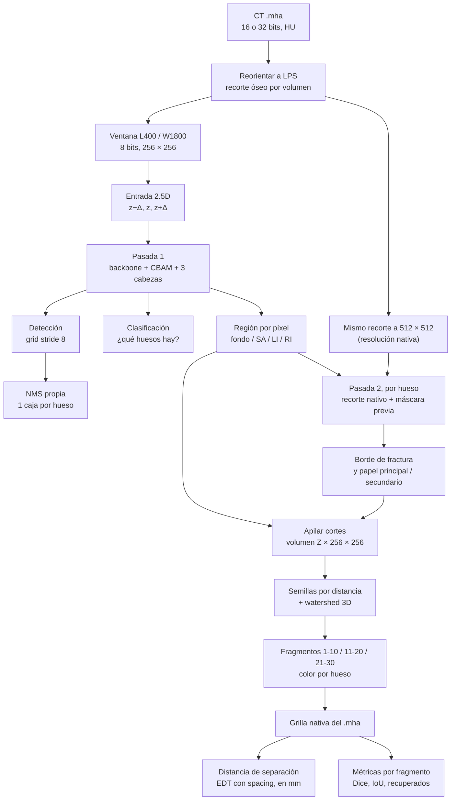

Correspondencia con el enunciado: *detección* (F2) → *NMS* (G) → *segmentación de instancia* (I, J,
K) → *clasificación por pertenencia* (L: cada fragmento hereda el hueso de la región donde nace) →
*distancia* (N) → *métricas* (O). La clasificación por pertenencia no necesita una decisión aparte:
las instancias se forman región por región, así que un fragmento no puede cambiar de hueso.

---

## 2. Arquitectura

### 2.1 Vista general

```
entrada 2.5D: cortes (z−Δ, z, z+Δ), Δ ≈ 2 mm, 256 × 256        [+ 4.º canal: máscara previa]
    │
backbone FundidoraPC extendida: 4 bloques conv 3×3 → BN → ReLU → residual → pooling
    C1 32 can. s2 · C2 64 can. s4 · C3 128 can. s8 + CBAM · C4 256 can. s16 + CBAM
    │                                   ── bifurcación ──
    ├── C4 → pooling global → lineal          cabeza 1: presencia de SA / coxal izq. / coxal der.
    ├── cuello: P3 = C3 + γ·up(C4) → grid     cabeza 2: puntaje + (l, t, r, b) por región, stride 8
    └── P3 + C2 + C1 (+ C0) → decodificador   cabeza 3: región (4 clases) + borde + papel
```

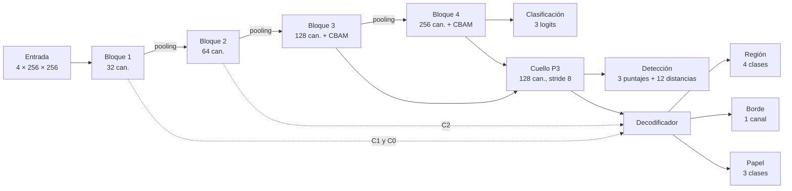

2 931 489 parámetros: backbone 67 %, detección 21 %, cuello 7 %, segmentación 5 %, clasificación
0,03 %. 33 convoluciones y 1 capa lineal. Entra con lote de 8 a 256 px y precisión mixta en una GPU
de 6 GB, que es la restricción del §4.3.

### 2.2 Por qué cada pieza, frente al §4.1

**Backbone compartido.** El enunciado pide una extensión propia de FundidoraPC. Se conservan sus
cuatro bloques, canales y núcleos, y se añaden dos cosas: un bloque residual por etapa, cuya última
normalización arranca en cero para que la red empiece siendo exactamente FundidoraPC, y la
exposición de los cuatro niveles en lugar del vector global. El residual resuelve el problema
clásico de la profundidad: aprender `F(x) + x` deja un camino de gradiente que no se atenúa.

**CBAM antes de la bifurcación.** Atención de canal (qué mapas importan, por una MLP sobre los
estadísticos globales) seguida de atención espacial (dónde, por una convolución 7×7 sobre el máximo
y la media entre canales), en C3 y C4. Todas las cabezas leen C3, C4 o mapas derivados, así que la
atención queda antes de la bifurcación como exige el enunciado. Se mezcla como
`y = x + γ·(CBAM(x) − x)` con γ aprendible desde 0, lo que permite medir cuánto la usa la red.

**Contexto 2.5D.** Una fractura casi axial se cierra entre cortes y no se ve en un corte aislado.
Tres cortes separados ≈ 2 mm como canales dan contexto en z sin convoluciones 3D, que el enunciado
excluye al pedir un diseño 2D corte a corte.

**Cabeza de detección propia (§3.1).** Grid sin anclas de stride 8 (32 × 32 celdas): cada celda
predice, por región, un puntaje y las cuatro distancias a los lados de la caja. Stride 8 y no 16
porque el 39 % de las cajas del sacro mide menos de 16 px. Una caja por región y corte, envolvente
de todas sus islas. La **NMS es propia** (`detection/nms.py`): voraz, por clase, con IoU 0,5 y como
máximo una caja por clase, porque una región aparece a lo sumo una vez por corte.

**Cabeza de segmentación (§3.2).** El enunciado pide "una salida semántica con una salida de
instancia" en "lógica de dos etapas". Un decodificador tipo U-Net sube desde P3 concatenando C2 y
C1; sobre su último mapa, convoluciones 1×1 dan:

- la **región** (fondo, SA, coxal izquierdo, coxal derecho): etapa 1, la salida semántica;
- el **borde de fractura**: superficie de contacto entre fragmentos del mismo hueso, en 3D;
- el **papel** de cada vóxel: fondo, fragmento principal o secundario.

Borde y papel son las señales de instancia; las instancias se forman después, en 3D (§4).

### 2.3 Función de pérdida multitarea

```
L = λ_cls · L_cls + λ_det · L_det + λ_seg · L_seg
```

Tres términos, uno por cabeza, como pide el §4.1.

- `L_cls`: entropía cruzada binaria multi-etiqueta (qué regiones hay en el corte).
- `L_det = focal(puntaje) + (1 − GIoU)(caja)`. La focal, con α = 0,25 y γ = 2, existe porque solo
  ≈ 1 % de las celdas es positiva: `(1 − p_t)^γ` apaga la contribución de los negativos fáciles. El
  GIoU penaliza también las cajas que no se solapan, donde el IoU no da gradiente.
- `L_seg = CE + Dice` de la región, `+ BCE ponderada + Dice` del borde, `+ CE ponderada + Dice` del
  papel. La entropía cruzada da gradiente estable por píxel; el Dice, `2|P∩G| / (|P| + |G|)`,
  optimiza directamente el solapamiento y no depende del tamaño de la clase. Los pesos de clase
  siguen la regla `∝ 1/√frecuencia`: 1 / 10,8 / 8,7 / 8,7 para la región y 1 / 5,6 / 16,5 para el
  papel.

**La distancia de separación no es un término de pérdida.** Es una medición determinista posterior
(§5); optimizarla por gradiente exigiría diferenciar a través de la formación de instancias.

**Calibración de λ.** No se copiaron de otra implementación. Se entrena 200 iteraciones con λ = 1,
se mide la norma del gradiente de cada término sobre la última capa compartida,
`G_k = ‖∇_θ L_k‖₂`, y se fija `λ_k = media(G) / G_k` normalizado a Σλ = 3. La idea es de GradNorm:
que ninguna tarea domine el backbone por tener gradientes de mayor escala. Resultado del modelo
base: cls 0,70, det 0,94, seg 1,35. Se recalibran en cada configuración y en cada fold.

### 2.4 Capas

34 capas con pesos (33 convoluciones y 1 lineal), 20 normalizaciones por lotes, 4 poolings y 4
dropouts. Entrada de 4 canales; salidas a la resolución indicada.

| componente | capa | núcleo | canales | resolución de salida | parámetros |
|---|---|---|---|---|---|
| Backbone, bloque 1 | conv + BN + ReLU | 3×3 | 4 → 32 | 256 | 1 152 |
| | residual (2 conv + 2 BN) | 3×3 | 32 → 32 | 256 (**C0**) | 18 432 |
| | max-pooling 2×2 | — | — | 128 (**C1**) | 0 |
| Backbone, bloque 2 | conv + BN + ReLU | 3×3 | 32 → 64 | 128 | 18 432 |
| | residual | 3×3 | 64 → 64 | 128 | 73 728 |
| | max-pooling | — | — | 64 (**C2**) | 0 |
| Backbone, bloque 3 | conv + BN + ReLU | 3×3 | 64 → 128 | 64 | 73 728 |
| | residual | 3×3 | 128 → 128 | 64 | 294 912 |
| | max-pooling | — | — | 32 | 0 |
| | CBAM canal (MLP 128 → 8 → 128) | 1×1 | — | 32 | 2 048 |
| | CBAM espacial | 7×7 | 2 → 1 | 32 (**C3**) | 98 |
| Backbone, bloque 4 | conv + BN + ReLU | 3×3 | 128 → 256 | 32 | 294 912 |
| | residual | 3×3 | 256 → 256 | 32 | 1 179 648 |
| | max-pooling | — | — | 16 | 0 |
| | CBAM canal (MLP 256 → 16 → 256) | 1×1 | — | 16 | 8 192 |
| | CBAM espacial | 7×7 | 2 → 1 | 16 (**C4**) | 98 |
| Cuello | lateral de C3 | 1×1 | 128 → 128 | 32 | 16 512 |
| | lateral de C4, ×2 | 1×1 | 256 → 128 | 32 | 32 896 |
| | suavizado + BN + ReLU | 3×3 | 128 → 128 | 32 (**P3**) | 147 456 |
| Clasificación | pooling global + dropout + lineal | — | 256 → 3 | 1 | 771 |
| Detección | torre de puntaje (2 conv + BN) | 3×3 | 128 → 128 | 32 | 294 912 |
| | torre de caja (2 conv + BN) | 3×3 | 128 → 128 | 32 | 294 912 |
| | puntaje por región | 3×3 | 128 → 3 | 32 | 3 459 |
| | caja (l, t, r, b) por región | 3×3 | 128 → 12 | 32 | 13 836 |
| Segmentación | P3 ↑ + C2 → conv + BN + ReLU | 3×3 | 192 → 64 | 64 | 110 592 |
| | ↑ + C1 → conv + BN + ReLU | 3×3 | 96 → 32 | 128 | 27 648 |
| | ↑ + C0 → conv + BN + ReLU | 3×3 | 64 → 32 | 256 | 18 432 |
| | región | 1×1 | 32 → 4 | 256 | 132 |
| | borde de fractura | 1×1 | 32 → 1 | 256 | 33 |
| | papel | 1×1 | 32 → 3 | 256 | 99 |

Los parámetros de la tabla son los de las convoluciones y la capa lineal; las normalizaciones y los
factores γ suman el resto hasta el total.

### 2.5 Parámetros

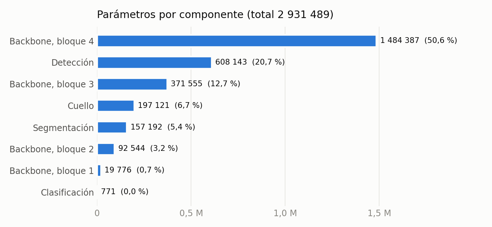

| componente | parámetros | % |
|---|---|---|
| Backbone (4 bloques + CBAM) | 1 968 262 | 67,1 |
| Cuello | 197 121 | 6,7 |
| Cabeza de clasificación | 771 | 0,03 |
| Cabeza de detección | 608 143 | 20,7 |
| Cabeza de segmentación | 157 192 | 5,4 |
| **Total** | **2 931 489** | 100 |

- El bloque 4 concentra la mitad del modelo: es donde hay más canales (256) y menos resolución.
- El CBAM completo son 10 438 parámetros, el 0,36 %: la atención es barata.
- Todo lo añadido en esta campaña (salto a resolución completa, salida de papel y cuarto canal de
  entrada) suma 9 603 parámetros, el 0,33 % del modelo de partida.
- Como referencia, un U-Net estándar ronda los 30 millones. Este modelo tiene una décima parte, lo
  que lo hace viable en CPU (§10) y en una GPU de 6 GB.

### 2.6 Representación numérica

| etapa | tipo | bits | por qué |
|---|---|---|---|
| CT original | entero con signo | 16 (47 casos) o 32 (53 casos) | como viene del escáner; valores de −6 211 a 47 685 HU |
| Tras recortar a [−1024, 3071] HU y ventana L400 / W1800 | entero sin signo | **8** | 256 niveles, ≈ 7 HU por nivel; ocupa 4 veces menos que float32 y permite leer el caché desde disco sin cargarlo |
| Etiquetas, borde, máscara previa | entero sin signo | 8 | identificadores 0-30 y mapas binarios |
| Entrada a la red | flotante | 32 | el valor de 8 bits dividido entre 255; no añade información |
| Activaciones con precisión mixta | flotante | 16 | exigido por el §4.3; reduce memoria y tiempo en GPU |
| Pérdidas y gradientes | flotante | 32 | en 16 bits los gradientes pequeños se anulan |
| Probabilidades guardadas | entero sin signo | 8 | probabilidad × 255 |

La cuantización a 8 bits no limita la detección de fracturas: el contraste entre hueso cortical y
una grieta es de cientos de HU, muy por encima de los 7 HU de un nivel. La ventana deja sin saturar
el 99,6 % de los vóxeles de hueso. La pérdida relevante es espacial (§4.3), no de intensidad.

---

## 3. Entrenamiento

| aspecto | decisión |
|---|---|
| Datos | 100 pacientes; todo reorientado a LPS (34 venían en RAS); recorte óseo por volumen; ventana nivel 400 / ancho 1800 HU cuantizada a 8 bits (≈ 7 HU por nivel) |
| Partición | por paciente, 70 / 15 / 15, balanceada por patrón de fractura, con hash |
| Validación | cruzada de 5 folds sobre los 85 de train + val, estratificada por n.º de secundarios; el test queda fuera |
| Optimizador | AdamW, lr 3·10⁻⁴ con coseno, decaimiento de pesos 10⁻⁴, recorte de gradiente 10 |
| Precisión mixta | `torch.amp` (la API vigente de `torch.cuda.amp`), como exige el §4.3 |
| Aumentación | afín (escala, rotación ±10°, traslación) e intensidad; **sin volteo horizontal**, porque la lateralidad es parte de la etiqueta |
| Regularización | dropout espacial en los bloques profundos; EMA de pesos en los modelos de la campaña |
| Semillas | fijas (42), una por modelo |

**Transfer learning.** El §4.1 lo permite solo en el backbone. Se probó con los pesos de
FundidoraPC del Taller 3 y se midió en validación cruzada con dos semillas: +0,0105 de Dice por
fragmento a favor de **no** usarlo, sin significancia (t = 1,19). No aporta; los modelos actuales
entrenan desde cero. Es la ablación con/sin transfer learning que el §7 pide para el informe.

**Prueba de correctitud.** El overfit intencional de 8 cortes (entregable de la semana 9) pasó:
caída de pérdida 98,8 %, Dice 0,992, mAP@0.5 1,00.

**Un defecto encontrado y corregido.** Al revisar el muestreo se comprobó que la aumentación no
cambiaba entre épocas: con el cargador en varios procesos persistentes, el contador de época no
llegaba a esos procesos y cada imagen recibía la misma transformación en todas las épocas. Afecta a
todos los modelos entrenados antes del 8 de octubre. Está corregido (la época vive en memoria
compartida) y hay una prueba que lo vigila. Es la explicación más probable del sobreajuste de la
cabeza de borde (pérdida 0,10 en entrenamiento contra 0,39 en validación) y de que entrenar más
épocas no ayudara. Su efecto se está midiendo (§6.6).

---

## 4. De la salida de la red a los fragmentos

La red predice por corte; un fragmento es un objeto 3D. El paso intermedio
(`postprocess/instances.py`) es donde se juega la métrica principal.

### 4.1 Semillas por distancia (`edt`)

Por región: núcleo = región sin borde; `d = distance_transform_edt(núcleo)` en mm; semillas = zonas
con `d > h`; watershed sobre `−d + 5·borde`; ids por volumen, el mayor es el principal.

La justificación es geométrica. Dos fragmentos que se tocan están unidos por un cuello, y un cuello
nunca es profundo: erosionar `h` mm lo corta aunque la red haya rellenado la grieta. Con el borde
real el óptimo es `h` = 1,5 mm; con el borde predicho hace falta `h` = 5 mm, porque la erosión
compensa lo que el borde no marca. El precio es que un fragmento más delgado que 2·`h` se queda sin
semilla: por eso el Dice de los fragmentos menores de 5 cm³ es 0 en test.

Frente a separar solo por el borde, `edt` vale +0,245 de Dice por fragmento (0,743 contra 0,498).
Es la mayor mejora individual del proyecto.

### 4.2 Separación por papel (`role`)

La red dice qué vóxeles son del principal y cuáles de un secundario. El principal conserva todas
sus componentes sin erosionar; los secundarios se separan entre sí con una erosión corta y los
restos finos se rescatan. La probabilidad se suaviza a lo largo de z, porque una red 2D decide
corte a corte y un secundario omitido en unos cortes sale partido en rodajas.

Es una clase densa (los secundarios son el 10,5 % del hueso, frente a 1 de cada 83 del borde) y
falla de forma gradual: un error en la frontera cuesta vóxeles de frontera, no fusiona dos
fragmentos.

### 4.3 Segunda pasada por hueso

A 256 px el píxel mide 1,2-1,6 mm y una grieta sin desplazamiento ocupa 1-2 px. El mismo modelo se
ejecuta dos veces: primero sobre el corte completo, y luego, por cada hueso encontrado, sobre un
recorte a resolución nativa (0,6-0,7 mm) con la máscara de ese hueso como cuarto canal de entrada.
Es la "lógica de dos etapas" del §3.2 llevada a la entrada.

- **No es una segunda red**: mismo backbone, mismas tres cabezas, 288 parámetros más.
- **Sin fuga de datos**: la máscara previa de entrenamiento viene de un modelo que no vio a ese
  paciente (predicciones fuera de fold), nunca del ground truth.

Detalle en `reports/tuning/y4xul/REFINAMIENTO.md`.

---

## 5. Medición de la distancia de separación (§3.3)

Para cada fragmento secundario, la distancia mínima borde a borde a su principal:

```
d = mín  sobre los vóxeles del fragmento  de  EDT(complemento del principal; sampling = spacing)
```

- El `spacing` es el del header, en orden (z, y, x), así que el resultado está en milímetros. Nunca
  se reporta una distancia en píxeles.
- La transformada mide de centro a centro de vóxel: dos fragmentos que se tocan dan ≈ 1 vóxel, no
  0. Se marca "en contacto" cuando `d ≤ diagonal del vóxel`.
- Se calcula igual sobre la predicción y sobre el ground truth, como pide el enunciado, para medir
  cuánto error transfiere la segmentación a la medida. Se reporta el error absoluto medio sobre los
  secundarios emparejados y **qué fracción se pudo medir**: si un secundario se fusiona con el
  principal no hay distancia, y un error bajo sobre pocos fragmentos no es un buen resultado.

| modelo (validación cruzada) | secundarios recuperados | error de distancia (MAE) |
|---|---|---|
| control | 59,8 % | 1,01 mm |
| + salida principal / secundario, método `role` | 55,3 % | 1,84 mm |
| + segunda pasada, método `edt` | **68,3 %** | **0,57 mm** |

En test, el modelo base: 51,3 % de secundarios medidos, MAE 2,20 mm (1,08 mm en los separados,
2,40 mm en los que están en contacto).

---

## 6. Resultados

### 6.1 Dónde está el techo (oráculos)

Antes de gastar GPU se le dio al posproceso información perfecta, por partes:

| región | borde / papel | Dice por fragmento |
|---|---|---|
| predicha | predicho | 0,743 |
| real | predicho | 0,770 |
| predicha | real | 0,902 |
| real | real | 0,995 |
| — | papel real, sin borde | 0,929 |

El procedimiento puede llegar a 0,995, así que el objetivo de 0,85 es alcanzable en principio. Lo
que falta está en la señal de separación, no en la región ni en el posproceso.

### 6.2 Validación cruzada: 5 folds, 85 pacientes

Una sola combinación de posproceso por modelo, elegida por la media de los folds.

| modelo | posproceso | Dice frag | IoU frag | Dice principal | Dice secundario | sec. recuperados | MAE distancia |
|---|---|---|---|---|---|---|---|
| control (sin TL) | edt | 0,7520 | 0,6892 | 0,9227 | 0,5688 | 59,8 % | 1,01 mm |
| + resolución completa | edt | 0,7651 | 0,7032 | 0,9257 | 0,5925 | 63,0 % | 0,92 mm |
| + papel | role | 0,7874 | 0,7101 | 0,9376 | 0,6252 | 55,3 % | 1,84 mm |
| + segunda pasada | edt | **0,7889** | **0,7252** | 0,9269 | **0,6412** | **68,3 %** | **0,57 mm** |

Emparejado por fold contra el control (t crítico 2,776 con 4 grados de libertad):

| modelo | Δ Dice | t | folds a favor |
|---|---|---|---|
| + resolución completa | +0,0131 | 4,23 | 5/5 |
| + papel | +0,0354 | 2,05 | 4/5 |
| + segunda pasada | +0,0369 | 3,13 | 5/5 |

### 6.3 Detección y clasificación

| modelo | F1 | AUC | IoU de caja | mAP@0.50 | mAP@[.50:.95] | Dice de región |
|---|---|---|---|---|---|---|
| control | 0,9871 | 0,9975 | 0,9068 | 0,9773 | 0,8341 | 0,9660 |
| + segunda pasada | 0,9893 | 0,9982 | 0,8932 | 0,9746 | 0,7997 | 0,9665 |

Añadir la salida de papel y afinar con recortes cuesta 0,034 de mAP@[.50:.95]. Sigue al doble del
objetivo. En los folds ya entrenados con la aumentación corregida ese coste casi desaparece (§6.6).

### 6.4 Frente a los objetivos del §5

| tarea | métrica | objetivo | validación cruzada (mejor modelo) | test (modelo base) | ¿cumple? |
|---|---|---|---|---|---|
| Clasificación | F1 | ≥ 0,85 | 0,989 | 0,993 | sí |
| Clasificación | AUC | ≥ 0,85 | 0,998 | 0,999 | sí |
| Detección | IoU promedio | ≥ 0,65 | 0,893 | 0,919 | sí |
| Detección | mAP@0.50 | ≥ 0,65 | 0,975 | 0,980 | sí |
| Detección | mAP@[.50:.95] | ≥ 0,40 | 0,800 | 0,864 | sí |
| Segmentación de fragmento | Dice | ≥ 0,85 | 0,789 | 0,725 | **no** |
| Segmentación de fragmento | IoU | ≥ 0,70 | 0,725 | 0,671 | sí en CV; no en test con el modelo base |

Sobre la métrica de fragmento: cada fragmento real se empareja con uno predicho por asignación
óptima y **el que no tiene pareja cuenta 0**. Es una definición exigente; un fragmento fusionado
con su principal no aporta nada aunque todos sus vóxeles estén bien clasificados como hueso. El
Dice por región, que no es lo que pide el enunciado, es 0,97.

### 6.5 Comparación contra SAM (§4.2)

SAM ViT-B en modo zero-shot, con la caja que predice nuestro detector como prompt, sobre el test
(15 pacientes, 3 765 cortes con hueso). SAM no forma parte del pipeline ni generó etiquetas.

| método | Dice | IoU | Dice sacro | tiempo por corte (RTX 3060) |
|---|---|---|---|---|
| modelo propio (base) | **0,968** | **0,938** | **0,954** | ≈ 12 ms |
| SAM + caja predicha | 0,908 | 0,832 | 0,863 | ≈ 417 ms |
| SAM + caja real (cota de SAM) | 0,908 | 0,832 | 0,866 | — |

- El modelo específico supera al generalista en 6 puntos de Dice y 11 de IoU, con 35 veces menos
  cómputo. La diferencia mayor está en el sacro, cuyos forámenes SAM no sigue.
- SAM rinde igual con nuestras cajas que con las reales: el detector no es lo que lo limita.
- La comparación es por región. SAM con una caja por hueso no puede separar fragmentos, así que en
  la métrica por fragmento no compite. **Pendiente: repetirla con el modelo actual**; se hizo con
  el modelo base.

### 6.6 Corrida en curso (parcial)

Modelo de dos pasadas con la aumentación corregida y muestreo eficiente, 40 épocas. Terminados los
folds 0, 1 y 2 y el modelo final sobre la partición oficial; los folds 3 y 4 están entrenando.
Cifras con el mejor posproceso de cada fold, **no comparables todavía** con la tabla del §6.2:

| fold | Dice frag, corrida anterior | Dice frag, corrida nueva | mAP@[.50:.95] anterior | nuevo | F1 anterior | nuevo |
|---|---|---|---|---|---|---|
| 0 | 0,789 | 0,777 | 0,798 | 0,820 | 0,989 | 0,992 |
| 1 | 0,778 | 0,779 | 0,795 | 0,826 | 0,990 | 0,993 |
| 2 | 0,837 | 0,842 | 0,796 | 0,828 | 0,986 | 0,993 |

Lectura provisional: la detección y la clasificación mejoran en los tres folds y quedan a menos de
0,007 de mAP del control; la separación de fragmentos queda igual. Se actualizará con los cinco folds.

### 6.7 Figuras

**Evolución de la métrica principal.** Cada barra añade un cambio sobre la anterior.

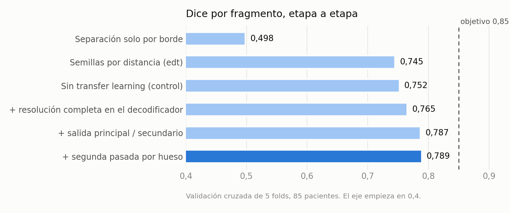

**Fold a fold.** El modelo de dos pasadas supera al control en los cinco folds; ninguno alcanza el
objetivo, y el fold 0 queda lejos en ambos.

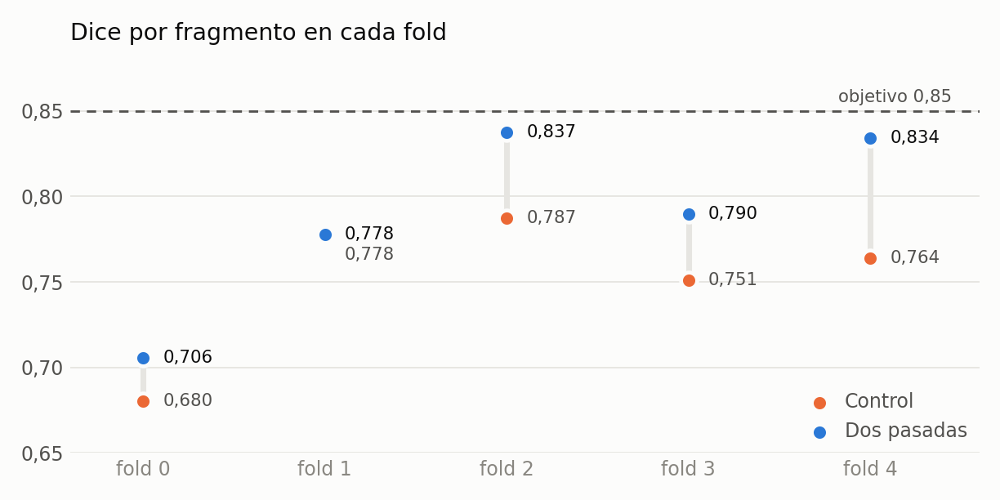

**Las siete métricas frente a su objetivo.**

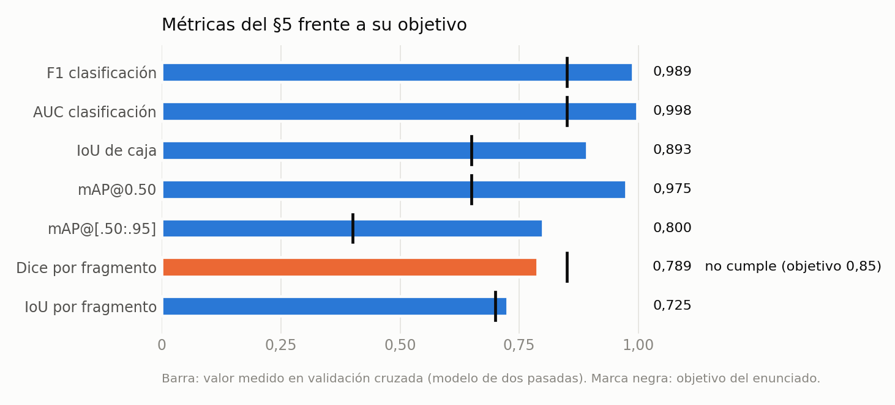

**Figuras del pipeline base** (rama `Nicolas`, semana 10):

| figura | qué muestra |
|---|---|
| 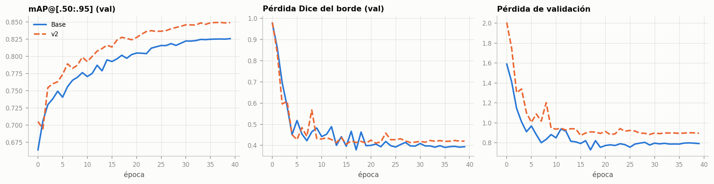 | Curvas de entrenamiento del modelo base y de `v2` |
| 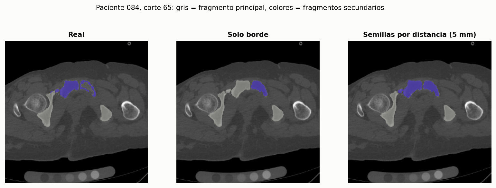 | Ejemplo de fragmentos predichos frente al ground truth |
| 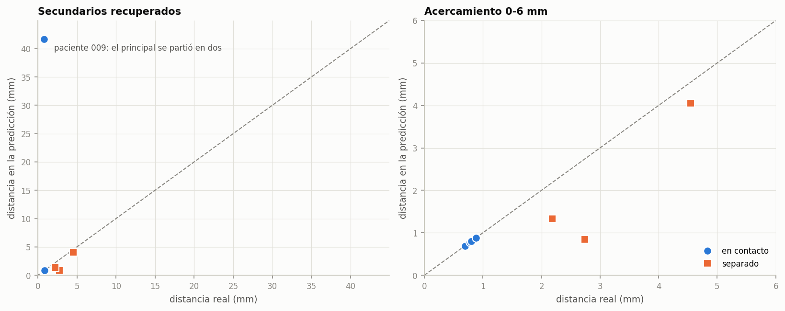 | Distancia de separación: predicción contra ground truth |
| 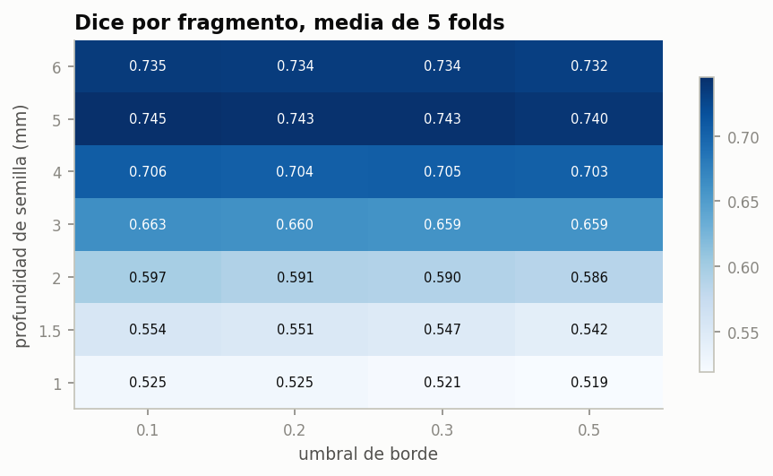 | Barrido de los parámetros del posproceso |
| 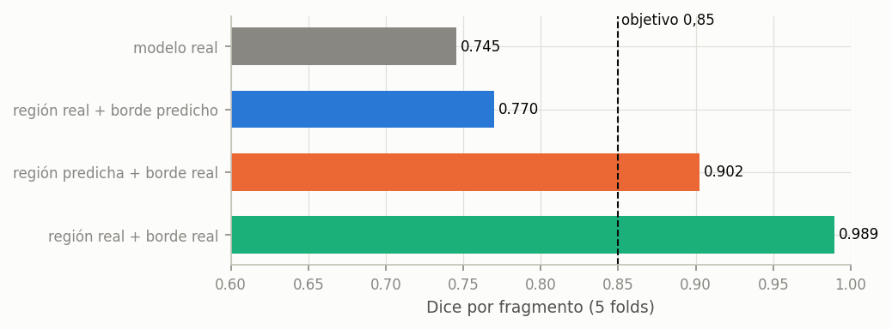 | Oráculos: cuánto se gana con región o borde perfectos |
| 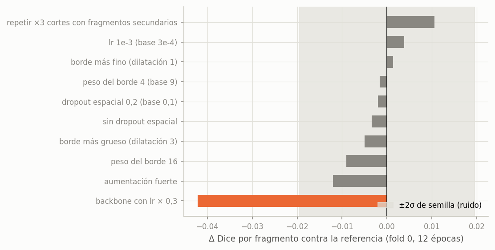 | Cribado de hiperparámetros frente al suelo de ruido |
| 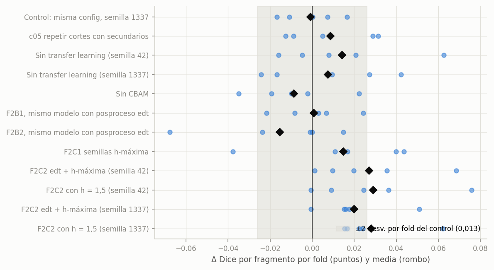 | Confirmación por fold de la Fase 1 |
| 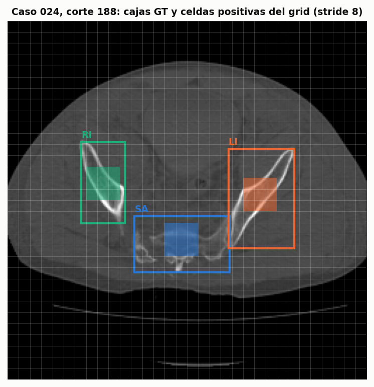 | Asignación de celdas positivas del grid de detección |
| 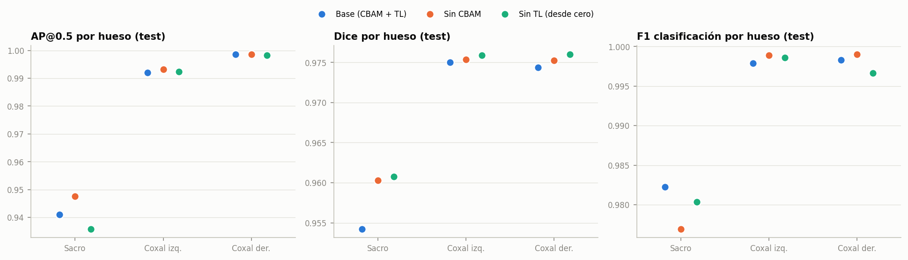 | Resultados por hueso en test |
| 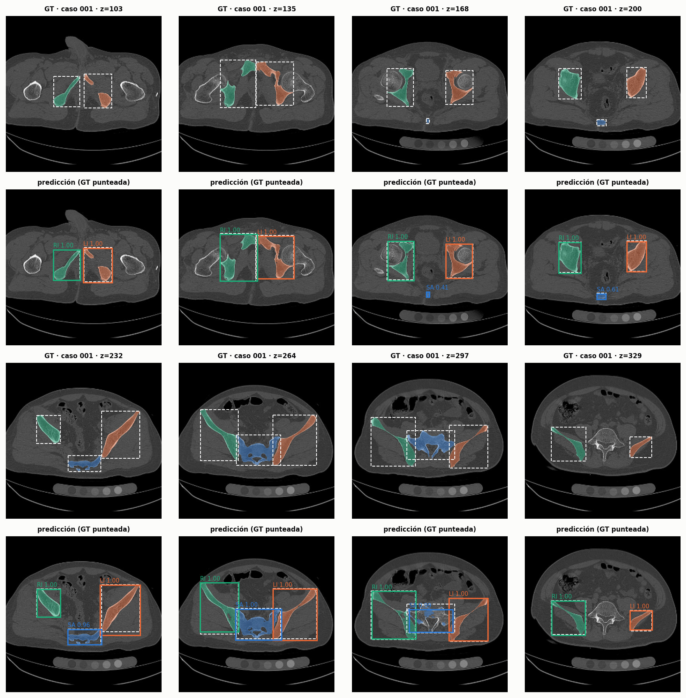 | Predicciones de cajas y regiones en test |

Las tres primeras figuras de esta sección se generan con `scripts/plot_informe_semana10.py`.

---

## 7. Qué se probó y no funcionó

Se reporta con la misma visibilidad que lo que sí funcionó.

| intento | resultado |
|---|---|
| 11 hiperparámetros de entrenamiento (Fase 1) | ninguno supera el ruido |
| Transfer learning del Taller 3 | sin efecto |
| Sin CBAM (ablación) | −0,009, sin significancia; se mantiene porque el enunciado lo exige |
| Núcleo / borde de 3 clases | −0,072 |
| Regresión de la distancia al borde | −0,241 |
| Semillas por h-máxima | recupera secundarios pero parte el principal |
| Pooling promedio en vez de máximo | peor que el máximo |
| Dice ponderado de la clase secundaria | −0,002 y −0,009 |
| Afinar 10 épocas más | 0,000 |

Regla común: nada se adopta por un resultado aislado. La Fase 1 midió el ruido entre semillas
(0,0097 a 12 épocas; 0,013 emparejado por fold a 20) y un cambio cuenta solo si supera dos veces
ese valor, gana en la mayoría de los folds y no empeora el IoU. Las hipótesis y las reglas se
escribieron antes de ver los resultados (`REGISTRO.md`).

---

## 8. Por qué no se alcanza 0,85

1. **Los fragmentos se tocan.** Nueve de cada diez secundarios están pegados a su principal. Si la
   fractura no dejó separación visible, no hay contraste que aprender.
2. **La red es 2D y la instancia es 3D.** Cada corte se decide por separado; la consistencia entre
   cortes se impone después, con suavizado y componentes 3D. El enunciado fija el diseño 2D.
3. **Pocos ejemplos de lo difícil.** 236 secundarios en 85 pacientes. La desviación entre folds
   (0,04-0,05) es mayor que casi todas las mejoras medidas.
4. **La resolución ayudaba, poco.** Duplicarla mejoró mucho la distancia (1,64 → 0,57 mm) y poco el
   Dice (+0,010).

El propio enunciado sitúa sus objetivos "deliberadamente por debajo del techo del challenge", cuyos
mejores resultados "provienen de arquitecturas 3D especializadas". La restricción 2D explica buena
parte de la distancia que queda.

---

## 9. Cumplimiento de las restricciones del documento base

| restricción | cumplimiento |
|---|---|
| Taxonomía de 3 regiones, sin subdividir la hemipelvis | sí |
| Etiquetas del dataset, sin generar nuevas | sí |
| Spacing del header en todas las distancias | sí, con prueba de la convención de ejes |
| Backbone propio extendiendo FundidoraPC | sí |
| Transfer learning solo en el backbone | sí; finalmente no se usa |
| CBAM antes de la bifurcación | sí |
| Tres cabezas sobre un mismo backbone | sí; la segunda pasada es el mismo modelo |
| Grid y NMS propios | sí |
| Pérdida multitarea con λ justificados | sí, por norma de gradiente |
| Sin YOLO, Detectron2, Mask R-CNN ni frameworks de alto nivel | sí |
| SAM solo como referencia | sí |
| 224-256 px, lote 8-16 | sí: 256 px, lote 8 |
| Precisión mixta | sí |
| Inferencia en GPU y CPU, con latencia reportada | medida para el modelo base (§10) |

---

## 10. Latencia

Modelo base, un corte, modelo + decodificación + NMS (`reports/latency/base.json`):

| dispositivo | media por corte |
|---|---|
| CPU Intel 11.ª gen., 8 hilos | 102 ms |
| GPU RTX 3060 Laptop | 10 ms |
| GPU con precisión mixta | 13 ms |

Volumen completo de 401 cortes en GPU: 3,4 s.

La segunda pasada añade ≈ 2,2 recortes por corte, unas 3,2 veces el cómputo del modelo. Hay una
variante selectiva implementada, que refina solo donde la primera pasada sospecha fractura; el EDA
indica que el 74 % de los recortes muestra un hueso de una sola pieza. **La latencia del modelo de
dos pasadas no se ha medido todavía.**

---

## 11. Verificación

- 169 pruebas automáticas; 159 en verde. Las 10 que fallan son de la Fase 2 y se deben a dos
  archivos de configuración que no se versionaron, no al código.
- Las pruebas usan phantoms sintéticos con respuesta conocida (IoU, NMS, decodificación del grid,
  distancia con spacing anisotrópico, separación de instancias, geometría de la segunda pasada) y
  no dependen del dataset.
- Reproducibilidad: `README.md`, `scripts/lab/y4xul.sh` y `scripts/lab/refinar.sh`.

---

## 12. Limitaciones y pendientes

**Limitaciones**
- Una sola semilla por modelo.
- El posproceso de cada modelo se eligió sobre los mismos folds en los que se reporta: sesgo
  optimista pequeño, igual para todos.
- La comparación con SAM y la latencia corresponden al modelo base.
- La corrida con la aumentación corregida cambia cuatro cosas a la vez; no separa cuánto aporta
  cada una.

**Pendientes para la semana 11**
1. Cerrar la corrida en curso y actualizar el §6.6.
2. Evaluación única en test con el modelo final.
3. Latencia en GPU y CPU con dos pasadas, completa y selectiva.
4. SAM frente al modelo final.
5. Visualizadores 2 y 3, dashboard, túnel de Cloudflare, model card e informe final.
6. Registrar este trabajo en `IA_USAGE.md` con el análisis crítico del equipo.

---

## 13. Registro de decisiones

Cada decisión del desarrollo, con la alternativa que se descartó y la evidencia que la sostiene.

### 13.1 Datos y entrada

| decisión | alternativa descartada | por qué |
|---|---|---|
| Reorientar todo a LPS | usar la orientación de cada archivo | 34 de 100 casos vienen en RAS; sin unificar, izquierda y derecha se intercambian en un tercio de los datos |
| Recorte óseo por volumen | redimensionar el corte entero | sube la resolución efectiva de 1,56 a 1,27 mm/px sin cortar hueso |
| 256 × 256 | 224 o 512 | dentro del rango recomendado (§4.3); 512 no cabe con lote 8 en 6 GB |
| Entrada 2.5D (3 cortes a ≈ 2 mm) | un solo corte | las fracturas casi axiales se cierran entre cortes; apagar los vecinos cuesta 0,045 de mAP |
| Ventana L400 / W1800 a 8 bits | HU completo en 16 bits | deja sin saturar el 99,6 % del hueso; el caché pesa 4 veces menos |
| Partición por paciente con hash | partición por corte | los cortes de un paciente son casi copias: partir por corte filtra información al test |
| Sin volteo horizontal | aumentación con volteo | la lateralidad es la etiqueta; voltear sin intercambiar clases la corrompe |
| 12 % de cortes vacíos | solo cortes con hueso | la cabeza de clasificación necesita negativos |

### 13.2 Arquitectura

| decisión | alternativa descartada | por qué |
|---|---|---|
| FundidoraPC + residual | backbone preentrenado estándar | el §4.1 pide una extensión propia del backbone del curso |
| CBAM en los bloques 3 y 4 | CBAM en todos, o ninguno | debe ir antes de la bifurcación; en los bloques 1-2 hay pocos canales y detalle fino |
| γ aprendible en CBAM y en el cuello | mezcla fija | permite medir cuánto usa la red cada pieza: γ = 0,18 en el bloque 3 (casi no la usa), −1,90 en el 4 |
| Sin transfer learning | pesos del Taller 3 | +0,0105 a favor de no usarlo, sin significancia (t = 1,19, 2 semillas, 5 folds) |
| Grid sin anclas, stride 8 | anclas, o stride 16 | el 39 % de las cajas del sacro mide menos de 16 px; sin anclas no hay hiperparámetros de forma |
| Una caja por región y corte | una caja por fragmento | el §3.1 pide cajas "de cada región anatómica" |
| NMS propia, 1 caja por clase | NMS de biblioteca | exigido por el §3.1; una región aparece a lo sumo una vez por corte |
| Pérdida focal + GIoU | BCE + L1 | ≈ 1 % de celdas positivas; el GIoU da gradiente aunque no haya solapamiento |
| Borde de fractura en 3D | borde dentro de cada corte | con el borde real, el 2D recupera el 35 % de los secundarios y el 3D el 71 % |
| Dropout espacial en bloques 3-4 | dropout por píxel | los píxeles vecinos están correlacionados; apagar canales enteros sí regulariza |
| Max-pooling | pooling promedio | el promedio rindió peor en el cribado (0,713 contra 0,729) |
| Características de resolución completa en el decodificador | interpolar de stride 2 a 1 | +0,013 de Dice por fragmento, t = 4,23, 5 de 5 folds, 9 216 parámetros |
| Salida de papel (principal / secundario) | solo el borde | el borde es 1 de cada 83 vóxeles; el papel es una clase densa (10,5 %) y protege el principal (+0,015) |
| Salidas extra como convoluciones 1×1 de la misma cabeza | una cuarta cabeza | el §4.1 fija tres cabezas |

### 13.3 Entrenamiento

| decisión | alternativa descartada | por qué |
|---|---|---|
| Tres términos de pérdida | añadir un término de distancia | la distancia es una medición posterior; no es diferenciable a través de la formación de instancias |
| λ por norma de gradiente | λ = 1, o copiados | el §4.1 pide calibrarlos y justificarlos; equilibra la presión de cada tarea sobre el backbone |
| Pesos de clase ∝ 1/√frecuencia | ∝ 1/frecuencia | la inversa directa sobrecompensa y vuelve inestable la clase rara |
| Dice de papel sin ponderar | secundario con peso 3 o 6 | −0,002 y −0,009 de Dice por fragmento |
| AdamW, lr 3·10⁻⁴, coseno | lr 10⁻³ | ninguno de los 11 hiperparámetros probados supera el ruido |
| Afinar el backbone entero | lr menor en el backbone | reducirlo a 0,3 empeora 4,3σ |
| Época en memoria compartida | atributo normal del dataset | con procesos persistentes la aumentación era idéntica en todas las épocas |
| EMA de pesos, 0,999 | sin EMA | +0,023 en el único fold medido; cuesta una copia del modelo |
| Evaluar la última época | elegir la mejor por validación | el criterio de selección promedia métricas saturadas; con coseno la última es la mejor |

### 13.4 Formación de instancias y medición

| decisión | alternativa descartada | por qué |
|---|---|---|
| Instancias en 3D tras apilar | componentes por corte | un fragmento aparece partido en islas 2D en el 18-40 % de los cortes |
| Semillas por distancia (`edt`) | componentes del núcleo sin borde | +0,245 de Dice por fragmento; la separación la hace la geometría |
| Erosión de 5 mm | 1,5 mm (óptimo con borde real) | compensa lo que el borde no marca; cuesta los fragmentos menores de 5 cm³ |
| No adoptar h-máximas | adoptarlas | recuperan secundarios pero parten el principal (−0,043) |
| Segunda pasada con el mismo modelo | una segunda red | el §4.1 pide un backbone compartido; cuesta 288 parámetros |
| Máscara previa de predicciones fuera de fold | máscara del ground truth | con máscaras perfectas la red aprende a fiarse de ellas y falla en inferencia |
| Volver a 256 px tras la segunda pasada | posprocesar a 512 px | mantiene el posproceso y las métricas comparables; 4 veces menos memoria |
| Distancia con `distance_transform_edt` y spacing del header | distancia en píxeles | exigido por el §3.3 |
| "En contacto" si d ≤ diagonal del vóxel | d = 0 | la transformada mide entre centros: dos vóxeles vecinos distan 1, no 0 |

### 13.5 Evaluación

| decisión | alternativa descartada | por qué |
|---|---|---|
| Validación cruzada de 5 folds por paciente | una sola partición de validación | con 15 pacientes de validación una diferencia de 0,02 no es distinguible del azar |
| Comparación emparejada por fold | comparar medias | baja el ruido de 0,045 a 0,013 |
| Umbral de 2σ y mayoría de folds | adoptar cualquier mejora | el ruido entre semillas es 0,013; por debajo de 0,026 no se distingue |
| Pre-registrar hipótesis y regla | decidir tras ver resultados | evita elegir la métrica o el umbral que favorece al candidato |
| Oráculos antes de entrenar | entrenar y ver | dicen si una idea puede alcanzar el objetivo sin gastar GPU |
| Test una sola vez | evaluar cada modelo en test | cada mirada al test lo convierte en un conjunto de validación más |
| Métrica por fragmento con emparejamiento óptimo | Dice por región | es lo que pide el §5; el Dice por región (0,97) no mide la separación |
| SAM solo como referencia | SAM en el pipeline | exigido por el §4.2 |
| Reportar lo que no funcionó | reportar solo las mejoras | sin los negativos no se puede saber qué queda por probar |
